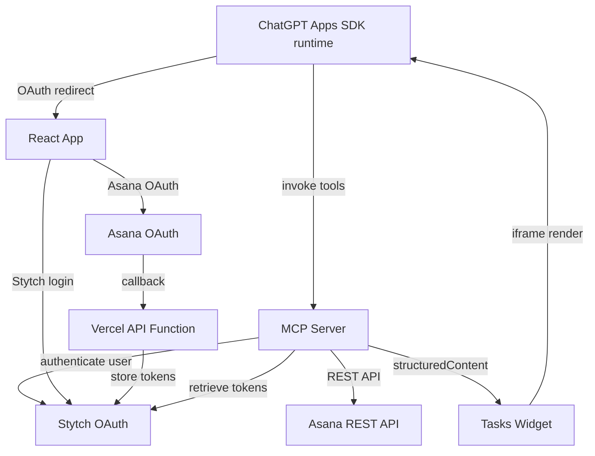
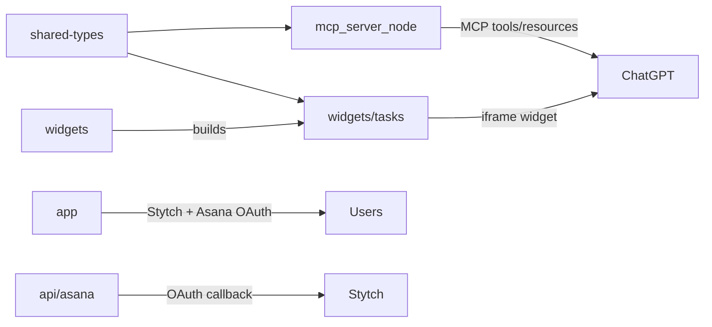

# Asana ChatGPT App

An OpenAI Apps SDK MCP server that integrates Asana tasks with ChatGPT. Users authenticate via Stytch OAuth, then connect their Asana account to view tasks due today in an interactive widget. The project is a pnpm workspace with four packages plus Vercel serverless functions:

- `app/` – React frontend with Stytch authentication and Asana OAuth authorization flow.
- `mcp_server_node/` – MCP HTTP server that exposes Asana tools/resources to ChatGPT. Uses Stytch for user authentication and stores Asana tokens in Stytch user metadata.
- `widgets/` – Tasks widget rendered by ChatGPT through the Apps SDK, built with React.
- `shared-types/` – TypeScript types shared across packages (tasks, workspaces, widget state).
- `api/` – Vercel serverless functions for Asana OAuth callback handling.

---

## System Overview



### Package Relationships



---

## Repository Layout

```
asana-chatgpt-app/
├─ package.json              # Workspace root
├─ pnpm-workspace.yaml       # Workspace configuration
├─ vercel.json               # Vercel deployment config
├─ api/
│  └─ asana/
│     └─ callback.ts         # Vercel function for Asana OAuth callback
├─ shared-types/
│  └─ src/index.ts           # Shared TypeScript types
├─ mcp_server_node/
│  ├─ src/config.ts          # Environment variable validation
│  ├─ src/auth.ts            # Auth helpers
│  ├─ src/stytch.ts          # Stytch client & user metadata operations
│  ├─ src/tokenStore.ts      # Token retrieval from Stytch
│  ├─ src/asanaClient.ts     # Asana REST API client
│  ├─ src/server.ts          # MCP tool/resource registrations
│  └─ src/index.ts           # HTTP server entrypoint
├─ widgets/
│  ├─ package.json           # Widget package config
│  ├─ vite.config.ts         # Vite build configuration
│  └─ tasks/
│     ├─ index.html          # Widget entry point
│     └─ index.tsx           # React widget UI
└─ app/
   ├─ package.json
   └─ src/
      ├─ App.tsx             # Main app with routes
      ├─ Login.tsx           # Stytch login page
      ├─ Authenticate.tsx    # Stytch auth callback
      ├─ Authorize.tsx       # MCP OAuth authorize
      └─ AsanaAuthorize.tsx  # Asana OAuth initiation
```

---

## Environment Variables

### MCP Server (`mcp_server_node`)

| Variable | Description |
| --- | --- |
| `MCP_HTTP_PORT` | Port for the MCP HTTP server (default `3000`). |
| `STYTCH_PROJECT_ID` | Stytch project ID for OAuth authentication. |
| `STYTCH_PROJECT_SECRET` | Stytch project secret. |
| `STYTCH_DOMAIN` | Stytch API domain (default `https://api.stytch.com`). |
| `ASANA_CLIENT_ID` | OAuth client ID from Asana developer console. |
| `ASANA_CLIENT_SECRET` | OAuth client secret from Asana. |
| `ASANA_REDIRECT_URI` | Redirect URI for Asana OAuth (points to Vercel function). |
| `ASANA_BASE_URL` | Asana API base URL (default `https://app.asana.com/api/1.0`). |
| `ASANA_OAUTH_AUTHORIZE_URL` | Asana OAuth authorize endpoint (default `https://app.asana.com/-/oauth_authorize`). |
| `ASANA_OAUTH_TOKEN_URL` | Asana OAuth token endpoint (default `https://app.asana.com/-/oauth_token`). |
| `FRONTEND_DOMAIN` | Public URL for the React app (e.g., `https://your-app.vercel.app` or `http://localhost:4444` for dev). |
| `DEV_MODE` | Set to `true` for local development (fetches widget HTML from Vite dev server). |

### React App (`app`)

| Variable | Description |
| --- | --- |
| `VITE_STYTCH_PUBLIC_TOKEN` | Stytch public token for client-side auth. |
| `VITE_FRONTEND_DOMAIN` | Frontend domain for redirects (default `http://localhost:3011`). |

### Vercel API Functions (`api`)

| Variable | Description |
| --- | --- |
| `ASANA_CLIENT_SECRET` | Asana OAuth client secret (for token exchange). |
| `STYTCH_PROJECT_ID` | Stytch project ID (for storing tokens). |
| `STYTCH_PROJECT_SECRET` | Stytch project secret. |
| `VITE_FRONTEND_DOMAIN` | Frontend domain for OAuth redirects. |

### Widget (`widgets`)

No environment variables required; the widget consumes data via Apps SDK `structuredContent`.

---

## Local Development (Dev Mode)

1. **Install dependencies**
   ```bash
   pnpm install
   ```

2. **Set up environment variables**
   Create `.env` files in `mcp_server_node/` and `app/` with the variables listed above. For local development:
   - Set `DEV_MODE=true` in MCP server
   - Set `FRONTEND_DOMAIN=http://localhost:4444` (widgets dev server)
   - Configure Stytch project credentials
   - Configure Asana OAuth credentials

3. **Run all services concurrently** (recommended)
   ```bash
   pnpm run dev:all
   ```
   This starts:
   - MCP server on `http://localhost:3000`
   - Widgets dev server on `http://localhost:4444`
   - React app on `http://localhost:3011` (via Vercel dev)

   Or run services individually:
   ```bash
   # Terminal 1: MCP server
   pnpm run dev:mcp

   # Terminal 2: Widgets
   pnpm run dev:widgets

   # Terminal 3: React app
   pnpm run dev:app
   ```

4. **Connect to ChatGPT Developer Mode**
   - Add MCP connector in ChatGPT Settings → Connectors
   - Point to `http://localhost:3000/mcp`
   - Configure Stytch OAuth settings in ChatGPT connector

---

## Production Deployment

### Vercel Deployment (App + API + Widgets)

The app, widgets, and API functions are deployed together to Vercel:

1. **Connect to Vercel**
   ```bash
   vercel
   ```

2. **Configure environment variables in Vercel**
   Set all required environment variables in Vercel dashboard:
   - `STYTCH_PROJECT_ID`, `STYTCH_PROJECT_SECRET`
   - `ASANA_CLIENT_SECRET`
   - `VITE_STYTCH_PUBLIC_TOKEN`
   - `VITE_FRONTEND_DOMAIN`

3. **Deploy**
   ```bash
   vercel --prod
   ```

   The `vercel.json` build command handles:
   - Building widgets with `vite build`
   - Copying widget assets to `app/public/`
   - Building the React app
   - Deploying API functions automatically

### MCP Server Deployment (Separate)

The MCP server should be deployed to a Node.js hosting platform (Railway, Render, etc.):

1. **Build the server**
   ```bash
   pnpm --filter asana-chatgpt-app-mcp-server build
   ```

2. **Deploy with environment variables**
   - Set all MCP server environment variables
   - Set `DEV_MODE=false`
   - Set `FRONTEND_DOMAIN` to your Vercel app URL
   - Ensure `ASANA_REDIRECT_URI` matches your Vercel API endpoint

3. **Configure Stytch OAuth**
   - Configure Stytch OAuth redirect URIs
   - Set up Asana OAuth app with correct redirect URI

### Connect to ChatGPT

1. Enable Developer Mode in ChatGPT
2. Add MCP connector pointing to your deployed MCP server (e.g., `https://your-mcp-server.com/mcp`)
3. Configure Stytch OAuth in ChatGPT connector settings

---

## Using the App

### Authentication Flow

1. **Authenticate with ChatGPT**
   - In ChatGPT, try to use an Asana tool
   - ChatGPT redirects you to authenticate via Stytch OAuth
   - Log in with your email (Stytch handles the authentication)

2. **Connect Asana Account**
   - After Stytch authentication, visit the React app home page
   - Click "Connect Asana Account"
   - Authorize the Asana OAuth app
   - The Vercel API function exchanges the code for tokens and stores them in Stytch user metadata

### Available MCP Tools

1. **`get-workspaces`**
   - Lists all Asana workspaces you have access to
   - Example prompt: "Show my Asana workspaces"
   - Returns workspace names and IDs

2. **`list-tasks-due-today`**
   - Fetches tasks due today for a specific workspace
   - Example prompt: "Show me tasks due today in workspace [workspace-gid]"
   - Renders an interactive widget with task details
   - Optionally include completed tasks with `includeCompleted: true`

3. **`register-auth-code`** (internal)
   - Used by the OAuth flow to register authorization codes
   - Not typically called directly by users

### Widget Features

The tasks widget displays:
- Task names and links to Asana
- Due dates and completion status
- Assignee information with photos
- Associated project names

---

## Architecture Notes

### Authentication & Token Storage

- **User Authentication**: Stytch OAuth handles MCP server authentication
- **Token Storage**: Asana OAuth tokens are stored in Stytch user's `trusted_metadata` field
- **Token Retrieval**: MCP server retrieves tokens from Stytch when making Asana API calls
- **OAuth Flow**: Separate OAuth flow for Asana authorization, handled by Vercel serverless function

### Widget Rendering

- Widgets use React with Tailwind CSS for styling
- The MCP server serves widget HTML differently based on `DEV_MODE`:
  - **Dev mode**: Fetches full HTML from Vite dev server, rewrites paths
  - **Production**: Serves built assets from Vercel deployment
- Widgets receive data via `structuredContent` from MCP tools

### Development Scripts

- `dev:all`: Runs all three services concurrently using `concurrently`
- `dev:mcp`: Runs MCP server with `tsx --watch`
- `dev:widgets`: Runs Vite dev server on port 4444
- `dev:app`: Runs Vercel dev server on port 3011

---

## Roadmap & Next Steps

- [ ] Add widget interactivity (refresh button, follow-up messages)
- [ ] Implement task filtering and sorting in widget
- [ ] Add support for more Asana endpoints (create task, update task, etc.)
- [ ] Add error handling and retry logic for API calls
- [ ] Implement token refresh logic
- [ ] Add comprehensive logging and monitoring

---

## License

MIT.