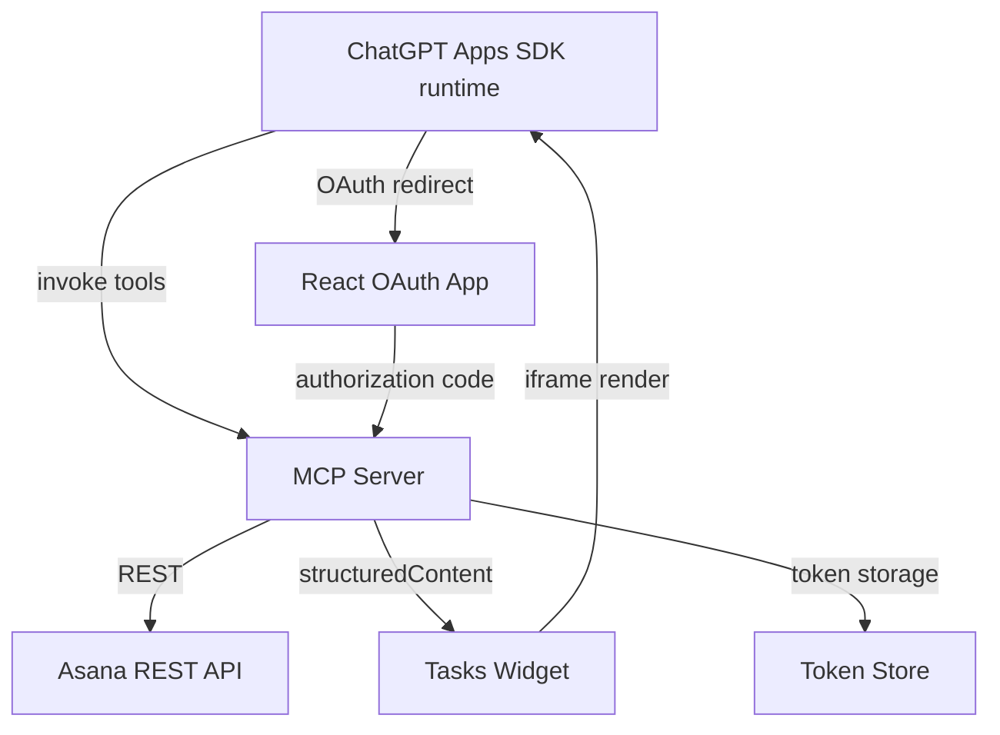
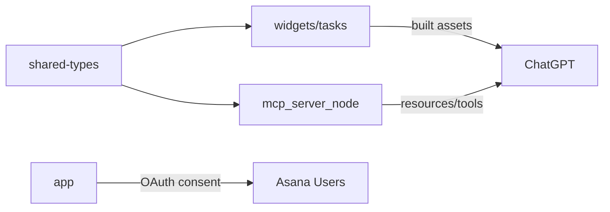

# Asana ChatGPT App

An OpenAI Apps SDK experience that mirrors the Chatagotchi architecture, repurposed to list Asana tasks due today. The project is split into a pnpm workspace with four packages:

- `app/` – React marketing + OAuth consent site (scaffolded for future work).
- `mcp_server_node/` – MCP HTTP server that handles OAuth, fetches Asana data, and exposes tools/resources to ChatGPT.
- `widgets/` – Web widgets rendered by ChatGPT through the Apps SDK (currently focused on the tasks micro-frontend).
- `shared-types/` – TypeScript contracts shared by the server and widget packages.

---

## System Overview



### Package Relationships



---

## Repository Layout

```
asana-chatgpt-app/
├─ package.json              # workspace root
├─ pnpm-workspace.yaml
├─ shared-types/
│  └─ src/index.ts           # Task & workspace contracts
├─ mcp_server_node/
│  ├─ src/config.ts          # Env validation
│  ├─ src/tokenStore.ts      # Local JSON token persistence
│  ├─ src/asanaClient.ts     # REST integration + OAuth exchange
│  ├─ src/server.ts          # MCP tool/resource registrations
│  └─ src/index.ts           # HTTP entrypoint (Streamable transport)
├─ widgets/
│  └─ tasks/
│     ├─ index.html          # Skybridge shell
│     ├─ src/App.tsx         # Widget UI (to be expanded)
│     └─ src/main.tsx        # React bootstrap
└─ app/
   └─ ... (React OAuth shell scaffolding)
```

---

## Environment Variables

### MCP Server (`mcp_server_node`)

| Variable | Description |
| --- | --- |
| `MCP_HTTP_PORT` | Port for the MCP HTTP server (default `3000`). |
| `ASANA_CLIENT_ID` | OAuth client ID from Asana developer console. |
| `ASANA_CLIENT_SECRET` | OAuth client secret. |
| `ASANA_REDIRECT_URI` | Redirect URI configured in Asana (points to `app/`). |
| `ASANA_BASE_URL` | Asana API base (default `https://app.asana.com/api/1.0`). |
| `ASANA_OAUTH_AUTHORIZE_URL` | OAuth authorize endpoint (default `https://app.asana.com/-/oauth_authorize`). |
| `ASANA_OAUTH_TOKEN_URL` | OAuth token endpoint (default `https://app.asana.com/-/oauth_token`). |
| `FRONTEND_DOMAIN` | Public URL for the marketing/OAuth site. |
| `WIDGETS_BASE_URL` | Public URL serving widget assets (e.g., Vercel). |
| `ASANA_TOKEN_STORE_PATH` | Optional path for token JSON file (defaults to `.data/asana-tokens.json`). |
| `DEVELOPER_SHARED_SECRET` | Optional shared secret for securing local MCP calls. |

### Widget (`widgets/tasks`)

No environment variables required; the widget consumes data via Apps SDK `structuredContent`.

---

## Local Development (Dev Mode)

1. **Install dependencies**  
   ```bash
   pnpm install
   ```

2. **Build shared types** (optional if using TypeScript project references)  
   ```bash
   pnpm --filter @asana-chatgpt-app/shared-types build
   ```

3. **Run MCP server**  
   ```bash
  pnpm --filter asana-chatgpt-app-mcp-server run start
   ```  

4. **Run widget dev server** (auto reloads)  
   ```bash
   pnpm --filter @asana-chatgpt-app/widget-tasks dev
   ```  
   - Serves at `http://localhost:4444` (matches default in `server.ts` resource registration).

5. **(Optional) OAuth app dev server** – once implemented, run `pnpm --filter asana-chatgpt-app-web dev`.

6. **Connect via MCP Inspector or ChatGPT Developer Mode**  
   Use the MCP server HTTP endpoint (`http://localhost:3000/mcp`) with the bearer token matching `DEVELOPER_SHARED_SECRET` (if configured).

---

## Production Deployment

1. **Shared Types** – Build once and publish as part of workspace pipeline (handled by `pnpm -r build`).

2. **Widgets** – Deploy to Vercel or static host with `pnpm --filter @asana-chatgpt-app/widget-tasks build`.  
   - The build outputs `dist/` containing `tasks.html`, `tasks.js`, `tasks.css`.  
   - Configure `WIDGETS_BASE_URL` to the deployment origin (e.g., `https://asana-tasks-widget.vercel.app`).

3. **MCP Server (e.g., Alpic / self-hosted)**  
   - Deploy `mcp_server_node/` bundle (build via `pnpm --filter asana-chatgpt-app-mcp-server build`).  
   - Provide environment variables listed above.  
   - Ensure persistent storage for the token JSON file or replace with secure database.

4. **OAuth Web App**  
   - Deploy `app/` to Vercel or similar, matching `ASANA_REDIRECT_URI` and `FRONTEND_DOMAIN`.

5. **ChatGPT Connection (Production)**  
   - Enable Developer Mode in ChatGPT.  
   - Add MCP connector pointing to the deployed server URL (e.g., `https://asana-chat-app.yourhost.com/mcp`).  
   - If using a shared secret, set it in ChatGPT connector settings.

---

## Using the App

1. **Authorize Asana**  
   - In ChatGPT, prompt: “Connect my Asana account.”  
   - The MCP tool `register-auth-code` will provide a link to the OAuth app (implementation placeholder).  
   - Complete OAuth; tokens are stored in the server token store.

2. **View Workspaces**  
   - Prompt: “List my Asana workspaces.”  
   - Returns a text summary plus structured data for UI.

3. **See Today’s Tasks**  
   - Prompt example: “Show tasks due today in workspace 12345, include completed ones.”  
   - The `list-tasks-due-today` tool fetches tasks and renders them via the widget.

4. **Refresh from Widget**  
   - Inside the widget UI, use the refresh button to re-trigger the tool (requires widget App component to handle `callTool` – to be completed).

---

## Visual Design Notes

- Widgets should remain under `maxHeight` constraints. The UI leverages CSS utilities for truncated content and responsive layout.
- Asana task cards highlight due status, completion state, assignee info, and project tags.
- Button actions follow Apps SDK best practices: `window.openai.callTool` for refresh and `window.openai.sendFollowUpMessage` for additional prompts.

---

## Roadmap & Next Steps

- Complete OAuth web app (`app/`) to handle consent UI and redirect flows.
- Finalize widget React components with actual structuredContent rendering and state persistence (`TaskWidgetState`).
- Add production-ready token storage (encrypt or use managed secrets).
- Expand README with screenshots once UI is finalized.

---

## License

MIT.